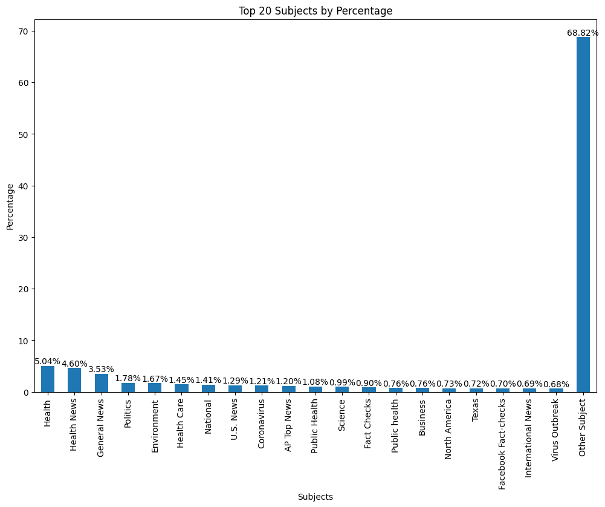
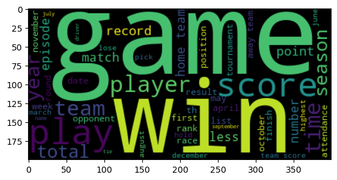

# Project Title

A brief description of what this project does and who it's for

# F21DL - Fact Checking

## Table of Contents

1. [Group Info](#group_info)
2. [Topic](#topic)
3. [Datasets used](#datasets)
    1. [Health Fact](#healthfact)
    2. [Tab Fact](#tabfact)
4. [Clustering](#clustering)
5. [Decision Trees](#decision-trees)
6. [Neural Networks and CNNs](#cnn)
7. [Conclusions](#conclusions)

---

## Group Info 

### Group Name:
JJM

### Group Members:
1. Javier @JavierSanchezCastro
2. Marc @marc-1212
3. Jose @eljoserass

## Topic 

With more information at our reach, it becomes a problem with the ease with which false information spreads. That is why it is important to have reliable systems that can automatically check the truthfulness behind statements online, this can empower individuals to quickly verify the truthfulness of information online, reducing the time that can usually come when checking this manually.

We aim to solve:

- Automatic Binary Classification from popular media
- Given a table relevant to a statement, prove that the statement goes according or not to the table.

Ethically, our main concerns are that the bias from the annotators will be reflected, and even amplified. This can be dangerous because if a model like this is implemented at scale, those biases can be extended further than the individual voice of the annotator. This can be harmful, particularly on topics of health and politics, which can be greatly influenced by the person's beliefs.

## Datasets used 

### Health Fact 

- Source:
https://huggingface.co/datasets/health_fact

- License:
[MIT License](https://choosealicense.com/licenses/mit/)

- Example:

| **claim_id** | 26723 | 9747 |
|---|---|---|
| **claim** | The coronavirus is "simply the common cold." | Heart Drug Linked to Extra Years for Cancer Patient |
| **date published** | March 9, 2020 | August 27, 2015 |
| **explanation** | The 2019 coronavirus is part of a family of viruses that produce illnesses... | This Wall Street Journal article nicely summarizes the findings of a  retrospective study of 1,400 cases of women with ovarian cancer... |
| **fact_checkers** | Tom Kertscher | Kathlyn Stone,Earle Holland,Kevin Lomangino |
| **main_text** | "If the current coronavirus were really the same as the common cold, why  would it be causing some people to die, stock markets to reel and  stadiums to go empty?... | The story mentions that beta-blockers are available as generics but  doesn’t specifically mention costs. As a class, beta blockers drugs are  low cost ($10 to $200 a month according to some estimates). The article  describes... |
| **sources** | https://www.cdc.gov/coronavirus/2019-ncov/about/symptoms.html... | http://onlinelibrary.wiley.com/doi/10.1002/cncr.29392/abstract... |
| **label** | 0 false | 2 true |
| **subjects** | Public Health, Facebook Fact-checks... | beta-blockers,ovarian cancer |

- Dataset Format

    **claim_id:** int

    **claim:** string

    **date_published:** string

    **explanation:** string

    **fact_checkers:** string

    **main_text:** string

    **sources:** string

    **label:** string

    **subjects:** string

- Summary:

[INCLUDE FOTOS FROM DATASET, NUMBER NAN...]

- Visualizations:

[INCLUDE FOTOS FROM DATASET, DESCRIBIING DE DISTRIBUTIONS]

- Conclusions:

[INCLUDE FOTOS FROM DATASET, DESCRIBIING DE DISTRIBUTIONS]

### Tab Fact  

- Source:
https://huggingface.co/datasets/tab_fact

 
- License:
[cc-by-4.0](https://creativecommons.org/licenses/by/4.0/)

DOWNLOAD EMBEDDINGS https://heriotwatt-my.sharepoint.com/:f:/r/personal/js2123_hw_ac_uk/Documents/files%20datamining?csf=1&web=1&e=9ctGl5

## Healt Fact:

## Tab Fact:

- Conclusions:

[INCLUDE FOTOS FROM DATASET, DESCRIBIING DE DISTRIBUTIONS]

## Cleaning process Health Fact:
- Check NaN values
- Transform empty strings into NaN values
- Explorate realtionships between the NaN values of the labels
- Visualize percentatge of the three labels with more NaN values
- Decide which labels should be take off and which rows should be deleted

## Cleaning process of Tab Fact:
- Check NaN values
- Replace string 'none' for np.nan values
 

## Clustering 
The input features in tab_fact dataset are the statement and table_text.

We expect to see if there is any correlation in 2d or 3d with the statements that are true and the ones that are false.

The algorithms we used: TSNE to reduce the dimensions to 2 and 3, and KMEANS for clustering itself.

[Notebook](notebooks/tab_fact/clustering/clustering_bert_TSNE.ipynb)

We tried several parameters, but the training time was to high and we didn't see or get any relationship or specific correlation with the data.

## Decision Trees 

Health Fact:
Input Features: Embeddings(main_text column -> BERT-TOKENIZER -> BERT-BASE-UNCASED -> matrix of 768 dimensions)

Train Split - 6k

Test Split - 1k

Accuracy: 0.34

This low accuracy might come from the fact that would be too optmistic to expect from the model to compress all this information with this algorithm.
What is likely happening is that is only picking certain vectors in a context and then assuming that is the representative from that class, leaving much meaning in the middle.

Tab Fact:
Input Features: X1 - Embeddings( table_text column -> BERT-TOKENIZER -> BERT-BASE-UNCASED -> matrix of 768 dimensions) 
X2 - Embeddings(main_text column -> BERT-BASE-UNCASED -> matrix of 768 dimensions)

Train Split - 91K

Test Split - 9K

Accuracy: 0.51

Similar to the previous dataset, with this algorithm the model is not able to encompass the whole " meaning " of the vector representation from the world, having similar accuracy to the representation of the labels in the dataset

## Neural Networks and CNNs 

Health Fact:
Embedding = main_text -> BERT-TOKENIZER -> BERT-BASE-UNCASED -> matrix of 768 dimensions
Input: Embedding -> Conv1D(filters=128, kernel_size=5, activation='relu') -> MaxPooling1D(pool_size=2) -> Flatten() -> Dense(1, activation='sigmoid')

Train Split - 6k

Test Split - 1k

Accuracy: 0.75

In this case, being a more complex model, the accuracy improved slightly, with the convolution in a way that can extract more meaning from the vectors embedding.

LLM LLama-7b:
The input is a table text that contains a CSV with data, and a statement of this data that can be True or False.

## The hyperparameters for this model are:
- LORA_R = 8
- LORA_ALPHA = 16
- LORA_DROPOUT= 0.05
- LORA_TARGET_MODULES = [ "q_proj", "v_proj", ]

- BATCH_SIZE = 8
- MICRO_BATCH_SIZE = 4
- GRADIENT_ACCUMULATION_STEPS = BATCH_SIZE // MICRO_BATCH_SIZE
- LEARNING_RATE = 3e-4
- TRAIN_STEPS = 50

## Conclusions 

This approach made us understand the power of Large Language Models for this task, although we used a lot of examples, and embeddings from a popular transformer model, it was still not enough to model the meaning in between words, to classify if an article was true or false, or to find if the statement was in relation with the provided table. 

The dataset although realistic, it was not enough in the scenario of the use case of this algorithm to achieve good results.

The models in this stage can be deployed but we do not consider the accuracy to be high enough to be used in a production environment.
